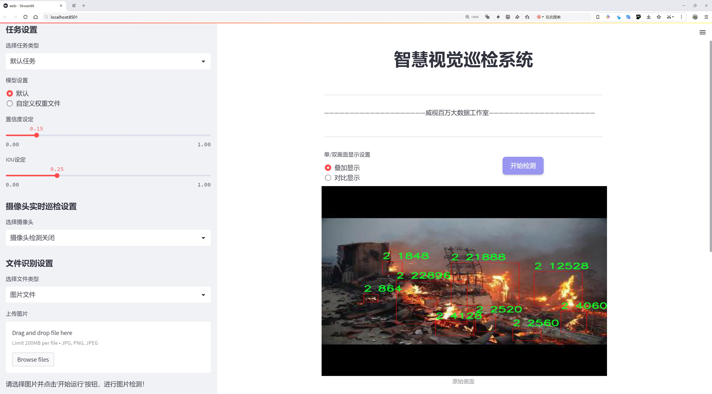
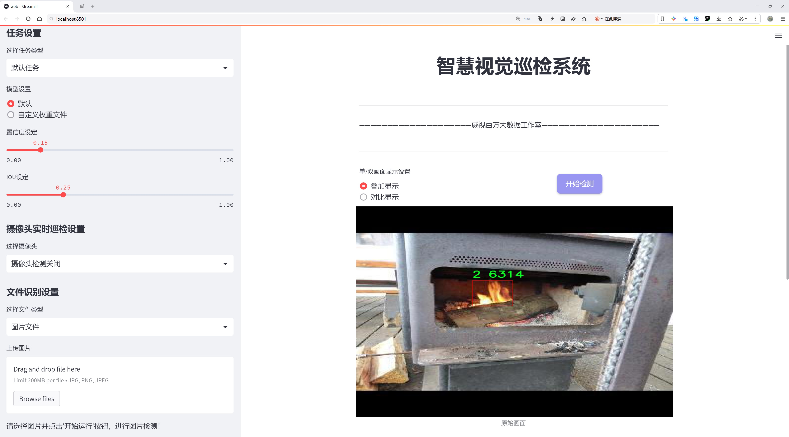
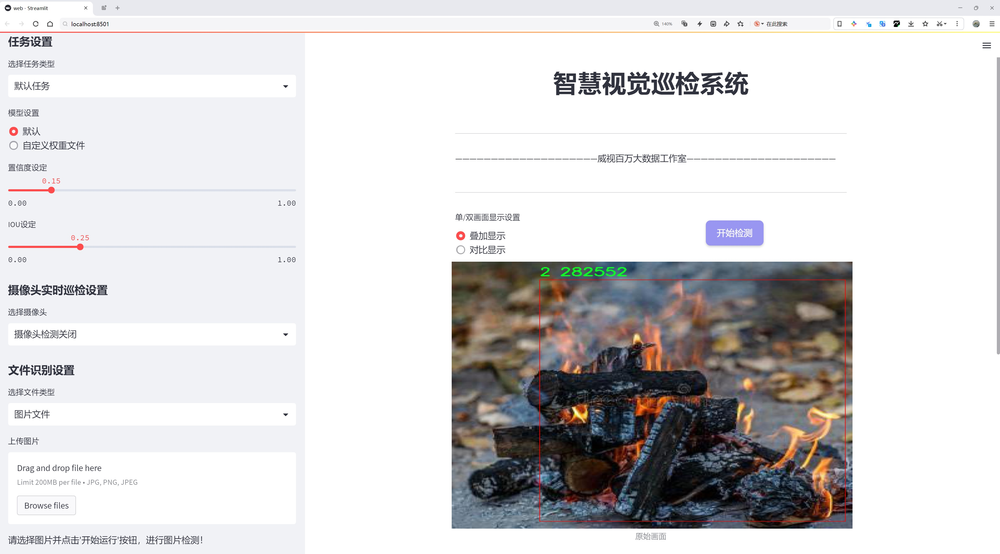
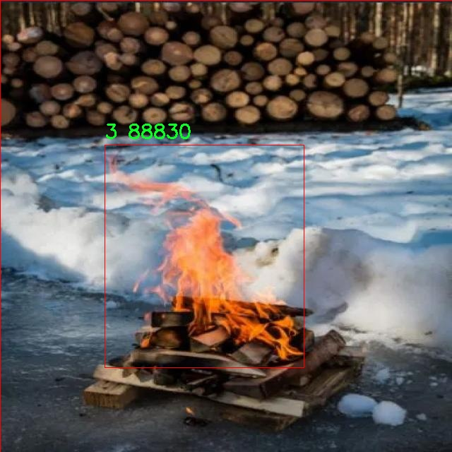
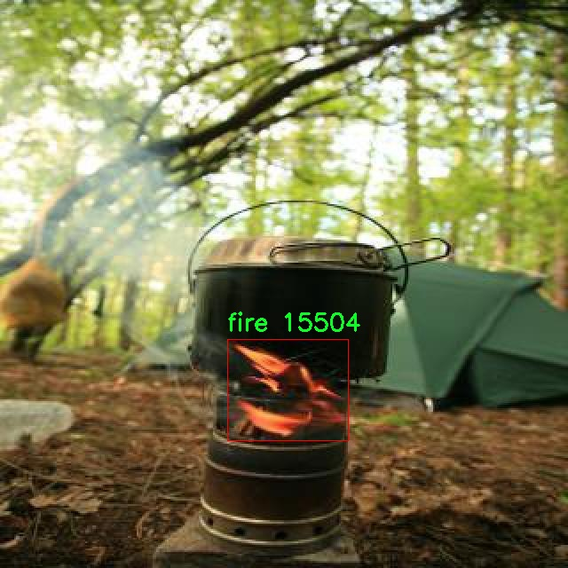
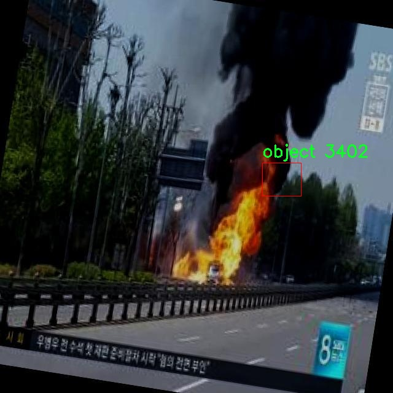

# 火灾检测与识别检测系统源码分享
 # [一条龙教学YOLOV8标注好的数据集一键训练_70+全套改进创新点发刊_Web前端展示]

### 1.研究背景与意义

项目参考[AAAI Association for the Advancement of Artificial Intelligence](https://gitee.com/qunshansj/projects)

项目来源[AACV Association for the Advancement of Computer Vision](https://gitee.com/qunmasj/projects)

研究背景与意义

随着城市化进程的加快和工业化水平的提升，火灾事故的发生频率逐年上升，给社会带来了巨大的经济损失和人员伤亡。根据统计数据，火灾不仅造成了直接的财产损失，还对环境和人类健康构成了严重威胁。因此，火灾的早期检测与快速响应成为了保障公共安全的重要课题。传统的火灾检测方法主要依赖于烟雾探测器和温度传感器等物理设备，然而这些方法在复杂环境下的可靠性和灵敏度往往受到限制。为此，基于计算机视觉和深度学习的火灾检测与识别系统逐渐成为研究的热点。

近年来，YOLO（You Only Look Once）系列目标检测算法因其高效性和实时性在计算机视觉领域取得了显著的成果。YOLOv8作为该系列的最新版本，进一步提升了检测精度和速度，适用于多种复杂场景的目标检测任务。通过对YOLOv8进行改进，可以更好地适应火灾检测的特殊需求，尤其是在多类别物体识别和动态场景分析方面。针对火灾检测任务，我们设计了一种基于改进YOLOv8的火灾检测与识别系统，旨在提高火灾发生时的响应速度和准确性。

本研究所使用的数据集包含9859张图像，涵盖了11个类别，包括液体、金属、固体、火焰、物体和烟雾等。这些类别的多样性为火灾检测提供了丰富的场景信息，能够有效模拟实际火灾发生时的复杂环境。通过对这些图像进行标注和训练，系统能够学习到不同物体的特征，从而在火灾发生时快速识别出火源和烟雾等关键因素。数据集的构建不仅为模型的训练提供了基础，也为后续的性能评估和优化提供了重要依据。

在研究意义方面，基于改进YOLOv8的火灾检测与识别系统不仅能够提高火灾的检测率和识别率，还能够在实际应用中实现实时监控和预警。通过将该系统应用于公共场所、工业园区和高风险区域，可以有效降低火灾事故的发生率和损失。此外，该系统的研究还为其他领域的目标检测提供了借鉴，推动了计算机视觉技术在安全监控、智能交通等领域的应用。

综上所述，基于改进YOLOv8的火灾检测与识别系统的研究，不仅具有重要的理论价值，也具备广泛的实际应用前景。通过深入探索和优化火灾检测技术，我们希望能够为提升公共安全水平贡献一份力量，同时为相关领域的研究提供新的思路和方法。

### 2.图片演示







##### 注意：由于此博客编辑较早，上面“2.图片演示”和“3.视频演示”展示的系统图片或者视频可能为老版本，新版本在老版本的基础上升级如下：（实际效果以升级的新版本为准）

  （1）适配了YOLOV8的“目标检测”模型和“实例分割”模型，通过加载相应的权重（.pt）文件即可自适应加载模型。

  （2）支持“图片识别”、“视频识别”、“摄像头实时识别”三种识别模式。

  （3）支持“图片识别”、“视频识别”、“摄像头实时识别”三种识别结果保存导出，解决手动导出（容易卡顿出现爆内存）存在的问题，识别完自动保存结果并导出到tempDir中。

  （4）支持Web前端系统中的标题、背景图等自定义修改，后面提供修改教程。

  另外本项目提供训练的数据集和训练教程,暂不提供权重文件（best.pt）,需要您按照教程进行训练后实现图片演示和Web前端界面演示的效果。

### 3.视频演示

[3.1 视频演示](https://www.bilibili.com/video/BV1zkt4eTEHX/)

### 4.数据集信息展示

##### 4.1 本项目数据集详细数据（类别数＆类别名）

nc: 11
names: ['0', '1', '2', '3', '4', 'Liquid', 'Metal', 'Solid', 'fire', 'object', 'smoke']


##### 4.2 本项目数据集信息介绍

数据集信息展示

在现代火灾检测与识别系统的研究中，数据集的构建与选择至关重要。为此，本研究采用了名为“Fire_Detection”的数据集，旨在为改进YOLOv8模型提供高质量的训练数据。该数据集包含11个类别，涵盖了火灾检测和识别所需的多种物体和状态。这些类别的细致划分，不仅为模型的训练提供了丰富的样本，也为后续的火灾预警和应急响应系统的优化奠定了基础。

在“Fire_Detection”数据集中，类别的命名从简单的数字（0至4）到具体的物质状态（液体、金属、固体）以及火灾相关的特征（火焰、物体、烟雾）均有涵盖。这种多样化的类别设置，使得模型能够在复杂的环境中更好地识别和分类不同的火灾信号。例如，类别“fire”专门用于标识火焰的存在，而“smoke”则用于检测烟雾的生成，这两者都是火灾发生的重要指示。通过将火焰和烟雾作为独立的类别，模型能够在火灾初期阶段及时做出反应，从而提高火灾响应的效率。

此外，数据集中包含的“Liquid”、“Metal”和“Solid”类别，分别代表了不同物质状态下可能引发火灾的物体。这一细分不仅帮助模型识别潜在的火灾源，还能够在特定场景下提供更为精准的警报。例如，液体类物质可能在高温环境下迅速挥发并引发火灾，而金属类物质在特定条件下也可能成为火灾的催化剂。通过对这些类别的深入学习，YOLOv8模型将能够更全面地理解火灾发生的机制，进而提升其检测的准确性和可靠性。

数据集的设计考虑到了实际应用中的多样性和复杂性。火灾的发生往往伴随着多种因素的交互作用，因此在训练过程中，模型需要面对各种可能的场景和条件。通过引入“object”类别，数据集进一步扩展了模型的识别能力，使其能够在复杂环境中识别出可能的火灾源。这样的设计不仅增强了模型的泛化能力，也为实际应用中的火灾监测提供了更为全面的支持。

综上所述，“Fire_Detection”数据集的构建充分考虑了火灾检测与识别的多维度需求，类别的多样性和细致划分为改进YOLOv8模型提供了坚实的基础。通过对这些类别的深入学习，模型将能够在实际应用中实现更高效的火灾检测和响应，为公共安全提供更为可靠的保障。随着数据集的不断完善和模型的持续优化，未来的火灾检测系统将能够在更广泛的场景中发挥重要作用，助力于构建更安全的社会环境。









### 5.全套项目环境部署视频教程（零基础手把手教学）

[5.1 环境部署教程链接（零基础手把手教学）](https://www.ixigua.com/7404473917358506534?logTag=c807d0cbc21c0ef59de5)


[5.2 安装Python虚拟环境创建和依赖库安装视频教程链接（零基础手把手教学）](https://www.ixigua.com/7404474678003106304?logTag=1f1041108cd1f708b01a)

### 6.手把手YOLOV8训练视频教程（零基础小白有手就能学会）

[6.1 手把手YOLOV8训练视频教程（零基础小白有手就能学会）](https://www.ixigua.com/7404477157818401292?logTag=d31a2dfd1983c9668658)

### 7.70+种全套YOLOV8创新点代码加载调参视频教程（一键加载写好的改进模型的配置文件）

[7.1 70+种全套YOLOV8创新点代码加载调参视频教程（一键加载写好的改进模型的配置文件）](https://www.ixigua.com/7404478314661806627?logTag=29066f8288e3f4eea3a4)

### 8.70+种全套YOLOV8创新点原理讲解（非科班也可以轻松写刊发刊，V10版本正在科研待更新）

由于篇幅限制，每个创新点的具体原理讲解就不一一展开，具体见下列网址中的创新点对应子项目的技术原理博客网址【Blog】：


[8.1 70+种全套YOLOV8创新点原理讲解链接](https://gitee.com/qunmasj/good)

### 9.系统功能展示（检测对象为举例，实际内容以本项目数据集为准）

图9.1.系统支持检测结果表格显示

  图9.2.系统支持置信度和IOU阈值手动调节

  图9.3.系统支持自定义加载权重文件best.pt(需要你通过步骤5中训练获得)

  图9.4.系统支持摄像头实时识别

  图9.5.系统支持图片识别

  图9.6.系统支持视频识别

  图9.7.系统支持识别结果文件自动保存

  图9.8.系统支持Excel导出检测结果数据


### 10.原始YOLOV8算法原理

原始YOLOv8算法原理

YOLOv8算法是目标检测领域的最新突破，承载着YOLO系列的优良传统，同时又在多个方面进行了创新和优化。该算法的核心结构由输入层、主干网络、颈部网络和头部网络四个主要组件构成，形成了一个高效且灵活的目标检测框架。通过这些组件的紧密协作，YOLOv8不仅提升了检测精度，还显著加快了处理速度，使其在实时应用中表现出色。

在YOLOv8的工作流程中，首先是输入层的图像预处理。原始图像会被缩放至指定的输入尺寸，以适应网络的要求。在这一过程中，YOLOv8引入了Mosaic增强技术，这种方法通过将多张图像拼接在一起，生成新的训练样本，从而增加了数据的多样性，提升了模型的泛化能力。这一过程为后续的特征提取奠定了基础。

主干网络是YOLOv8的特征提取核心，采用了CSPDarknet结构，具有更高的特征提取能力。与前代模型相比，YOLOv8用C2f模块替代了C3模块。C2f模块通过将输入特征图分为两个分支，每个分支经过卷积层进行降维，进而实现特征的深度提取。这种设计不仅增强了模型的梯度流动，还保留了轻量级特性，使得YOLOv8在处理复杂场景时依然能够保持高效。值得注意的是，C2f模块的引入使得特征图的维度得以提升，进一步丰富了模型对细节的捕捉能力。

在主干网络的末尾，YOLOv8采用了SPPF（快速空间金字塔池化）模块，通过三个最大池化层处理多尺度特征。这一设计旨在增强网络的特征抽象能力，使得模型能够有效应对不同尺寸的目标。这种多尺度特征处理的能力，使得YOLOv8在复杂环境下的目标检测表现尤为突出。

颈部网络则是YOLOv8中至关重要的特征融合部分。它结合了特征金字塔网络（FPN）和路径聚合网络（PAN），通过双塔结构促进了不同尺度特征图的信息融合。这种结构的设计不仅巩固了网络特征融合的能力，还增强了对不同尺度目标的检测性能。通过有效的特征融合，YOLOv8能够在复杂场景中更好地识别和定位目标，提升了整体的检测精度。

在目标检测模块中，YOLOv8采用了解耦的检测头结构。该结构通过两个并行的卷积分支分别计算回归和类别的损失，这种设计大大加速了模型的收敛速度，并提高了检测的准确性。解耦头的使用使得YOLOv8能够更灵活地处理不同类型的目标，进而提升了检测的效率。

YOLOv8的另一个显著特点是其无锚框（Anchor-Free）的检测方式。传统的目标检测方法通常依赖于预定义的锚框，而YOLOv8则直接预测目标的中心点和宽高比例。这一创新减少了锚框的数量，简化了模型的复杂性，同时提高了检测速度和准确度。这种无锚框的设计使得YOLOv8在面对多样化的目标时，能够更快速、准确地进行检测。

综上所述，YOLOv8算法通过其精心设计的网络结构和创新的特征处理方式，展现了在目标检测领域的强大能力。其输入层的预处理、主干网络的特征提取、颈部网络的特征融合以及头部网络的解耦检测，都相辅相成，共同推动了YOLOv8在检测精度和速度上的双重提升。随着YOLOv8的广泛应用，其在智能监控、自动驾驶、无人机视觉等领域的潜力也将不断被挖掘，推动目标检测技术的进一步发展。


### 11.项目核心源码讲解（再也不用担心看不懂代码逻辑）

#### 11.1 ui.py

以下是经过简化和注释的核心代码：

```python
import sys
import subprocess
from QtFusion.path import abs_path

def run_script(script_path):
    """
    使用当前 Python 环境运行指定的脚本。

    Args:
        script_path (str): 要运行的脚本路径
    """
    # 获取当前 Python 解释器的路径
    python_path = sys.executable

    # 构建运行命令，使用 streamlit 运行指定的脚本
    command = f'"{python_path}" -m streamlit run "{script_path}"'

    # 执行命令并等待其完成
    result = subprocess.run(command, shell=True)
    
    # 检查命令执行结果，如果返回码不为0，则表示出错
    if result.returncode != 0:
        print("脚本运行出错。")

# 程序入口
if __name__ == "__main__":
    # 获取要运行的脚本的绝对路径
    script_path = abs_path("web.py")

    # 调用函数运行脚本
    run_script(script_path)
```

### 代码注释说明：
1. **导入模块**：
   - `sys`：用于获取当前 Python 解释器的路径。
   - `subprocess`：用于执行外部命令。
   - `abs_path`：从 `QtFusion.path` 导入的函数，用于获取文件的绝对路径。

2. **run_script 函数**：
   - 接受一个参数 `script_path`，表示要运行的 Python 脚本的路径。
   - 使用 `sys.executable` 获取当前 Python 解释器的路径。
   - 构建一个命令字符串，使用 `streamlit` 模块运行指定的脚本。
   - 使用 `subprocess.run` 执行命令，并等待其完成。
   - 检查命令的返回码，如果不为0，打印错误信息。

3. **程序入口**：
   - 使用 `if __name__ == "__main__":` 确保代码仅在直接运行时执行。
   - 调用 `abs_path` 获取 `web.py` 的绝对路径。
   - 调用 `run_script` 函数来运行指定的脚本。

这个程序文件 `ui.py` 的主要功能是运行一个指定的 Python 脚本，具体来说是通过 Streamlit 框架来启动一个 Web 应用。程序首先导入了必要的模块，包括 `sys`、`os` 和 `subprocess`，这些模块分别用于获取系统信息、操作文件系统和执行外部命令。

在文件的开头，定义了一个名为 `run_script` 的函数，该函数接受一个参数 `script_path`，这个参数是要运行的脚本的路径。函数内部首先获取当前 Python 解释器的路径，这通过 `sys.executable` 实现。接着，构建一个命令字符串，该命令使用当前的 Python 解释器来运行 Streamlit，并指定要运行的脚本路径。命令的格式是 `"{python_path}" -m streamlit run "{script_path}"`，其中 `python_path` 和 `script_path` 会被相应的路径替换。

然后，使用 `subprocess.run` 方法来执行这个命令。这个方法会在一个新的子进程中运行命令，并等待其完成。如果命令执行的返回码不为零，表示脚本运行出错，程序会打印出相应的错误信息。

在文件的最后部分，使用 `if __name__ == "__main__":` 这一条件判断来确保只有在直接运行该脚本时才会执行以下代码。这部分代码指定了要运行的脚本路径，这里是通过调用 `abs_path("web.py")` 来获取 `web.py` 的绝对路径。最后，调用 `run_script` 函数来运行指定的脚本。

总体来说，这个文件的作用是为一个 Streamlit 应用提供一个启动入口，通过运行 `web.py` 脚本来启动 Web 应用。

#### 11.2 code\ultralytics\models\fastsam\model.py

以下是代码中最核心的部分，并附上详细的中文注释：

```python
from pathlib import Path  # 导入Path类，用于处理文件路径
from ultralytics.engine.model import Model  # 从ultralytics库中导入Model类
from .predict import FastSAMPredictor  # 导入FastSAMPredictor类，用于预测
from .val import FastSAMValidator  # 导入FastSAMValidator类，用于验证

class FastSAM(Model):
    """
    FastSAM模型接口。

    示例用法：
        ```python
        from ultralytics import FastSAM

        model = FastSAM('last.pt')  # 创建FastSAM模型实例，加载指定的模型文件
        results = model.predict('ultralytics/assets/bus.jpg')  # 对指定图片进行预测
        ```
    """

    def __init__(self, model="FastSAM-x.pt"):
        """初始化FastSAM类，调用父类Model的初始化方法，并设置默认模型。"""
        # 如果传入的模型名称是"FastSAM.pt"，则将其更改为"FastSAM-x.pt"
        if str(model) == "FastSAM.pt":
            model = "FastSAM-x.pt"
        # 确保传入的模型文件不是.yaml或.yml格式，因为FastSAM只支持预训练模型
        assert Path(model).suffix not in (".yaml", ".yml"), "FastSAM models only support pre-trained models."
        # 调用父类的初始化方法，设置模型和任务类型为"segment"
        super().__init__(model=model, task="segment")

    @property
    def task_map(self):
        """返回一个字典，将分割任务映射到相应的预测器和验证器类。"""
        return {"segment": {"predictor": FastSAMPredictor, "validator": FastSAMValidator}}
```

### 代码核心部分说明：
1. **导入模块**：导入了处理路径、模型类、预测器和验证器所需的模块。
2. **FastSAM类**：继承自`Model`类，表示FastSAM模型的接口。
3. **初始化方法**：在初始化时检查模型文件类型，并确保使用的模型是预训练模型。
4. **任务映射**：通过`task_map`属性，提供了一个字典，方便将分割任务与相应的预测和验证类关联起来。

这个程序文件定义了一个名为 `FastSAM` 的类，它是一个用于图像分割的模型接口，继承自 `Model` 类。首先，文件引入了必要的模块，包括 `Path` 用于处理文件路径，以及从 `ultralytics.engine.model` 导入的 `Model` 类。此外，还引入了 `FastSAMPredictor` 和 `FastSAMValidator`，它们分别用于模型的预测和验证。

在 `FastSAM` 类的文档字符串中，提供了一个使用示例，展示了如何实例化 `FastSAM` 模型并对图像进行预测。用户可以通过传入模型文件的路径（如 `'last.pt'`）来创建模型实例，并使用 `predict` 方法对指定的图像进行处理。

构造函数 `__init__` 接受一个参数 `model`，默认值为 `"FastSAM-x.pt"`。在构造函数中，如果传入的模型名称是 `"FastSAM.pt"`，则将其更改为 `"FastSAM-x.pt"`。接着，程序会检查传入的模型文件后缀，确保它不是 YAML 格式的文件，因为 `FastSAM` 模型只支持预训练模型。最后，调用父类的构造函数 `super().__init__`，传递模型路径和任务类型（这里是 `"segment"`）。

`task_map` 属性返回一个字典，该字典将任务类型（在这里是 `"segment"`）映射到相应的预测器和验证器类。这使得 `FastSAM` 模型能够灵活地处理不同的任务，并与相应的组件进行交互。

总体而言，这个文件为使用 `FastSAM` 模型提供了一个清晰的接口，方便用户进行图像分割任务的实现。

#### 11.3 code\ultralytics\utils\callbacks\wb.py

以下是代码中最核心的部分，并附上详细的中文注释：

```python
# 导入必要的库
from ultralytics.utils import SETTINGS, TESTS_RUNNING
from ultralytics.utils.torch_utils import model_info_for_loggers

try:
    # 确保当前不是在运行测试
    assert not TESTS_RUNNING  
    # 确保WandB集成已启用
    assert SETTINGS["wandb"] is True  
    import wandb as wb  # 导入WandB库

    # 确保WandB库已正确安装
    assert hasattr(wb, "__version__")  

    import numpy as np  # 导入NumPy库
    import pandas as pd  # 导入Pandas库

    _processed_plots = {}  # 用于存储已处理的图表

except (ImportError, AssertionError):
    wb = None  # 如果导入失败或断言失败，则将wb设置为None


def _custom_table(x, y, classes, title="Precision Recall Curve", x_title="Recall", y_title="Precision"):
    """
    创建并记录自定义指标可视化到wandb.plot.pr_curve。

    该函数创建一个自定义指标可视化，模仿wandb默认的精确度-召回曲线的行为，同时允许增强的自定义。
    该可视化指标用于监控模型在不同类别上的性能。

    参数:
        x (List): x轴的值；预期长度为N。
        y (List): y轴的对应值；也预期长度为N。
        classes (List): 标识每个点类别的标签；长度为N。
        title (str, optional): 图表的标题；默认为'Precision Recall Curve'。
        x_title (str, optional): x轴的标签；默认为'Recall'。
        y_title (str, optional): y轴的标签；默认为'Precision'。

    返回:
        (wandb.Object): 适合记录的wandb对象，展示所创建的指标可视化。
    """
    # 创建一个DataFrame以存储数据
    df = pd.DataFrame({"class": classes, "y": y, "x": x}).round(3)
    fields = {"x": "x", "y": "y", "class": "class"}
    string_fields = {"title": title, "x-axis-title": x_title, "y-axis-title": y_title}
    
    # 返回一个WandB表格对象
    return wb.plot_table(
        "wandb/area-under-curve/v0", wb.Table(dataframe=df), fields=fields, string_fields=string_fields
    )


def _plot_curve(
    x,
    y,
    names=None,
    id="precision-recall",
    title="Precision Recall Curve",
    x_title="Recall",
    y_title="Precision",
    num_x=100,
    only_mean=False,
):
    """
    记录指标曲线可视化。

    该函数基于输入数据生成指标曲线，并将可视化记录到WandB。
    曲线可以表示聚合数据（均值）或单个类别数据，具体取决于'only_mean'标志。

    参数:
        x (np.ndarray): x轴的数据点，长度为N。
        y (np.ndarray): y轴的对应数据点，形状为CxN，其中C表示类别数量。
        names (list, optional): 对应于y轴数据的类别名称；长度为C。默认为空列表。
        id (str, optional): 在WandB中记录数据的唯一标识符。默认为'precision-recall'。
        title (str, optional): 可视化图表的标题。默认为'Precision Recall Curve'。
        x_title (str, optional): x轴的标签。默认为'Recall'。
        y_title (str, optional): y轴的标签。默认为'Precision'。
        num_x (int, optional): 可视化的插值数据点数量。默认为100。
        only_mean (bool, optional): 标志，指示是否仅绘制均值曲线。默认为True。

    注意:
        该函数利用'_custom_table'函数生成实际的可视化。
    """
    # 创建新的x轴数据
    if names is None:
        names = []
    x_new = np.linspace(x[0], x[-1], num_x).round(5)

    # 创建用于记录的数组
    x_log = x_new.tolist()
    y_log = np.interp(x_new, x, np.mean(y, axis=0)).round(3).tolist()

    if only_mean:
        # 如果仅绘制均值曲线
        table = wb.Table(data=list(zip(x_log, y_log)), columns=[x_title, y_title])
        wb.run.log({title: wb.plot.line(table, x_title, y_title, title=title)})
    else:
        # 否则绘制所有类别的曲线
        classes = ["mean"] * len(x_log)
        for i, yi in enumerate(y):
            x_log.extend(x_new)  # 添加新的x数据
            y_log.extend(np.interp(x_new, x, yi))  # 将y插值到新的x
            classes.extend([names[i]] * len(x_new))  # 添加类别名称
        wb.log({id: _custom_table(x_log, y_log, classes, title, x_title, y_title)}, commit=False)


def on_fit_epoch_end(trainer):
    """在每个训练周期结束时记录训练指标和模型信息。"""
    wb.run.log(trainer.metrics, step=trainer.epoch + 1)  # 记录当前周期的指标
    # 记录图表
    _log_plots(trainer.plots, step=trainer.epoch + 1)
    _log_plots(trainer.validator.plots, step=trainer.epoch + 1)
    if trainer.epoch == 0:
        # 仅在第一个周期记录模型信息
        wb.run.log(model_info_for_loggers(trainer), step=trainer.epoch + 1)


def on_train_end(trainer):
    """在训练结束时将最佳模型保存为artifact。"""
    _log_plots(trainer.validator.plots, step=trainer.epoch + 1)
    _log_plots(trainer.plots, step=trainer.epoch + 1)
    art = wb.Artifact(type="model", name=f"run_{wb.run.id}_model")  # 创建模型artifact
    if trainer.best.exists():
        art.add_file(trainer.best)  # 添加最佳模型文件
        wb.run.log_artifact(art, aliases=["best"])  # 记录artifact
    # 记录验证指标曲线
    for curve_name, curve_values in zip(trainer.validator.metrics.curves, trainer.validator.metrics.curves_results):
        x, y, x_title, y_title = curve_values
        _plot_curve(
            x,
            y,
            names=list(trainer.validator.metrics.names.values()),
            id=f"curves/{curve_name}",
            title=curve_name,
            x_title=x_title,
            y_title=y_title,
        )
    wb.run.finish()  # 结束WandB运行
```

### 代码核心部分解释：
1. **WandB集成**：代码首先尝试导入WandB库并进行一些基本的检查，以确保它能够正常工作。
2. **自定义表格绘制**：`_custom_table`函数用于创建精确度-召回曲线的可视化，并将其记录到WandB中。
3. **曲线绘制**：`_plot_curve`函数根据输入数据生成曲线，并记录到WandB，支持绘制均值曲线或所有类别的曲线。
4. **训练过程中的回调**：在训练的不同阶段（如每个周期结束时）记录训练指标和模型信息，确保模型的性能可视化和最佳模型的保存。

这个程序文件是一个用于与WandB（Weights and Biases）集成的回调模块，主要用于记录和可视化深度学习模型训练过程中的各种指标和图表。文件首先导入了一些必要的库和模块，包括Ultralytics的设置和工具，以及WandB库。通过一些断言检查，确保在非测试环境下运行，并且WandB集成已启用。如果导入失败，WandB将被设置为None。

接下来，定义了几个辅助函数。`_custom_table`函数用于创建并记录一个自定义的精确度-召回曲线的可视化图表。它接受x轴和y轴的数据、类别标签以及图表的标题等参数，生成一个Pandas DataFrame，并利用WandB的plot_table功能记录该图表。

`_plot_curve`函数用于生成并记录一个指标曲线的可视化。它根据输入的数据生成x轴和y轴的点，并根据`only_mean`参数决定是绘制平均曲线还是每个类别的曲线。该函数使用`_custom_table`来生成实际的可视化。

`_log_plots`函数则负责记录输入字典中的图表，如果在指定的步骤中尚未记录过这些图表。它会检查每个图表的时间戳，确保每个图表只记录一次。

接下来的几个函数是与训练过程相关的回调函数。`on_pretrain_routine_start`在预训练开始时初始化WandB项目。`on_fit_epoch_end`在每个训练周期结束时记录训练指标和模型信息。`on_train_epoch_end`在每个训练周期结束时记录标签损失和学习率，并在特定条件下记录图表。`on_train_end`在训练结束时保存最佳模型，并记录验证器的图表和曲线。

最后，程序定义了一个回调字典`callbacks`，根据WandB是否可用来决定是否包含这些回调函数。这些回调函数在训练过程中被调用，以便实时记录和可视化模型的训练进展。整体而言，这个模块的设计旨在提高模型训练的可视化和监控能力，便于研究人员和开发者分析模型性能。

#### 11.4 70+种YOLOv8算法改进源码大全和调试加载训练教程（非必要）\ultralytics\models\yolo\detect\train.py

以下是代码中最核心的部分，并附上详细的中文注释：

```python
class DetectionTrainer(BaseTrainer):
    """
    DetectionTrainer类，继承自BaseTrainer类，用于基于检测模型的训练。
    """

    def build_dataset(self, img_path, mode='train', batch=None):
        """
        构建YOLO数据集。

        参数:
            img_path (str): 包含图像的文件夹路径。
            mode (str): 模式，可以是'train'或'val'，用户可以为每种模式自定义不同的增强。
            batch (int, optional): 批次大小，仅在'rect'模式下使用。默认为None。
        """
        gs = max(int(de_parallel(self.model).stride.max() if self.model else 0), 32)  # 获取模型的最大步幅
        return build_yolo_dataset(self.args, img_path, batch, self.data, mode=mode, rect=mode == 'val', stride=gs)

    def get_dataloader(self, dataset_path, batch_size=16, rank=0, mode='train'):
        """构造并返回数据加载器。"""
        assert mode in ['train', 'val']  # 确保模式有效
        with torch_distributed_zero_first(rank):  # 在分布式训练中，仅初始化一次数据集
            dataset = self.build_dataset(dataset_path, mode, batch_size)  # 构建数据集
        shuffle = mode == 'train'  # 训练模式下打乱数据
        if getattr(dataset, 'rect', False) and shuffle:
            LOGGER.warning("WARNING ⚠️ 'rect=True'与DataLoader的shuffle不兼容，设置shuffle=False")
            shuffle = False  # 如果使用rect模式，禁用shuffle
        workers = self.args.workers if mode == 'train' else self.args.workers * 2  # 设置工作线程数
        return build_dataloader(dataset, batch_size, workers, shuffle, rank)  # 返回数据加载器

    def preprocess_batch(self, batch):
        """对一批图像进行预处理，包括缩放和转换为浮点数。"""
        batch['img'] = batch['img'].to(self.device, non_blocking=True).float() / 255  # 将图像转换为浮点数并归一化
        return batch

    def set_model_attributes(self):
        """设置模型的属性，包括类别数量和名称。"""
        self.model.nc = self.data['nc']  # 将类别数量附加到模型
        self.model.names = self.data['names']  # 将类别名称附加到模型
        self.model.args = self.args  # 将超参数附加到模型

    def get_model(self, cfg=None, weights=None, verbose=True):
        """返回一个YOLO检测模型。"""
        model = DetectionModel(cfg, nc=self.data['nc'], verbose=verbose)  # 创建检测模型
        if weights:
            model.load(weights)  # 加载权重
        return model

    def get_validator(self):
        """返回用于YOLO模型验证的DetectionValidator。"""
        self.loss_names = 'box_loss', 'cls_loss', 'dfl_loss'  # 定义损失名称
        return yolo.detect.DetectionValidator(self.test_loader, save_dir=self.save_dir, args=copy(self.args))

    def plot_training_samples(self, batch, ni):
        """绘制带有注释的训练样本。"""
        plot_images(images=batch['img'],
                    batch_idx=batch['batch_idx'],
                    cls=batch['cls'].squeeze(-1),
                    bboxes=batch['bboxes'],
                    paths=batch['im_file'],
                    fname=self.save_dir / f'train_batch{ni}.jpg',
                    on_plot=self.on_plot)  # 保存训练样本图像

    def plot_metrics(self):
        """从CSV文件中绘制指标。"""
        plot_results(file=self.csv, on_plot=self.on_plot)  # 保存结果图像
```

### 代码核心部分说明：
1. **DetectionTrainer类**：该类用于处理YOLO模型的训练过程，继承自基础训练类`BaseTrainer`。
2. **build_dataset方法**：构建YOLO数据集，支持训练和验证模式。
3. **get_dataloader方法**：构造数据加载器，支持分布式训练。
4. **preprocess_batch方法**：对输入图像进行预处理，将其转换为浮点数并归一化。
5. **set_model_attributes方法**：设置模型的类别数量和名称等属性。
6. **get_model方法**：返回YOLO检测模型，并可选择加载预训练权重。
7. **get_validator方法**：返回用于模型验证的验证器。
8. **plot_training_samples和plot_metrics方法**：用于可视化训练样本和训练指标。

该程序文件是用于YOLOv8目标检测模型训练的实现，继承自基础训练类`BaseTrainer`，提供了一系列方法来构建数据集、获取数据加载器、预处理图像、设置模型属性、获取模型和验证器等功能。

在`DetectionTrainer`类中，首先定义了一个构造数据集的方法`build_dataset`，该方法根据传入的图像路径和模式（训练或验证）构建YOLO数据集，并允许用户自定义不同的增强方式。数据集的构建依赖于`build_yolo_dataset`函数，并且会根据模型的步幅大小来调整。

接下来，`get_dataloader`方法用于构建和返回数据加载器。它会检查模式是否为训练或验证，并在分布式训练的情况下确保数据集只初始化一次。该方法还会处理数据加载时的洗牌选项，并根据模式设置工作线程的数量。

`preprocess_batch`方法负责对图像批次进行预处理，将图像转换为浮点数并进行归一化处理。`set_model_attributes`方法则用于设置模型的属性，包括类别数量和类别名称等，以确保模型能够正确处理训练数据。

`get_model`方法用于返回一个YOLO检测模型，如果提供了权重文件，则会加载这些权重。`get_validator`方法返回一个用于模型验证的验证器实例，记录损失名称以便后续分析。

在训练过程中，`label_loss_items`方法用于返回带标签的训练损失字典，以便在训练过程中监控模型性能。`progress_string`方法则返回一个格式化的字符串，显示训练进度，包括当前的轮次、GPU内存使用情况、损失值、实例数量和图像大小等信息。

此外，`plot_training_samples`方法用于绘制训练样本及其标注，方便可视化训练数据的效果。最后，`plot_metrics`和`plot_training_labels`方法分别用于绘制训练过程中的指标和标签，以便于分析模型的训练效果和数据集的标注情况。

总体来说，该文件提供了YOLOv8模型训练的核心功能，涵盖了数据处理、模型构建、训练监控和结果可视化等多个方面，便于用户进行目标检测任务的训练和调试。

#### 11.5 70+种YOLOv8算法改进源码大全和调试加载训练教程（非必要）\ultralytics\data\__init__.py

```python
# Ultralytics YOLO 🚀, AGPL-3.0 license

# 从基础模块导入 BaseDataset 类
from .base import BaseDataset

# 从构建模块导入构建数据加载器、构建 YOLO 数据集和加载推理源的函数
from .build import build_dataloader, build_yolo_dataset, load_inference_source

# 从数据集模块导入分类数据集、语义数据集和 YOLO 数据集的类
from .dataset import ClassificationDataset, SemanticDataset, YOLODataset

# 定义模块的公开接口，包含可以被外部访问的类和函数
__all__ = ('BaseDataset', 'ClassificationDataset', 'SemanticDataset', 'YOLODataset', 
           'build_yolo_dataset', 'build_dataloader', 'load_inference_source')
```

### 代码注释说明：

1. **模块说明**：代码开头注释说明了该模块是 Ultralytics YOLO 的一部分，并声明了使用的许可证（AGPL-3.0）。

2. **导入语句**：
   - `from .base import BaseDataset`：从当前包的 `base` 模块中导入 `BaseDataset` 类，`BaseDataset` 是所有数据集的基类，提供了基本的数据处理功能。
   - `from .build import build_dataloader, build_yolo_dataset, load_inference_source`：从 `build` 模块中导入三个函数：
     - `build_dataloader`：用于构建数据加载器，负责数据的批处理和加载。
     - `build_yolo_dataset`：用于构建 YOLO 数据集，处理特定于 YOLO 的数据格式。
     - `load_inference_source`：用于加载推理所需的数据源。
   - `from .dataset import ClassificationDataset, SemanticDataset, YOLODataset`：从 `dataset` 模块中导入三个数据集类：
     - `ClassificationDataset`：用于分类任务的数据集类。
     - `SemanticDataset`：用于语义分割任务的数据集类。
     - `YOLODataset`：用于 YOLO 目标检测任务的数据集类。

3. **`__all__` 变量**：定义了模块的公开接口，指定了哪些类和函数可以被外部访问。这有助于控制模块的可见性，避免不必要的命名冲突。

这个程序文件是Ultralytics YOLO（You Only Look Once）算法的一部分，主要用于数据处理和加载。文件的开头包含了版权信息，表明该代码遵循AGPL-3.0许可证。

在文件中，首先从其他模块导入了一些基础类和函数。这些导入的内容包括：

- `BaseDataset`：这是一个基础数据集类，可能用于其他数据集的继承和扩展。
- `build_dataloader`：这个函数用于构建数据加载器，负责从数据集中加载数据以供模型训练或推理使用。
- `build_yolo_dataset`：这个函数用于构建YOLO格式的数据集，可能会处理数据的预处理和格式转换。
- `load_inference_source`：这个函数用于加载推理所需的数据源，可能是用于模型评估或测试的数据。

此外，还导入了几个具体的数据集类：

- `ClassificationDataset`：用于分类任务的数据集类。
- `SemanticDataset`：用于语义分割任务的数据集类。
- `YOLODataset`：专门为YOLO算法设计的数据集类，可能包含YOLO特有的数据处理逻辑。

最后，`__all__`变量定义了模块的公共接口，列出了可以被外部导入的类和函数。这意味着当其他模块使用`from .data import *`时，只会导入这些指定的类和函数。

整体来看，这个文件的主要功能是组织和管理与数据集相关的类和函数，为YOLO算法的训练和推理提供必要的数据支持。

#### 11.6 train.py

以下是经过简化和注释的核心代码部分，主要集中在YOLO检测模型的训练过程中：

```python
import random
import numpy as np
import torch.nn as nn
from ultralytics.data import build_dataloader, build_yolo_dataset
from ultralytics.engine.trainer import BaseTrainer
from ultralytics.models import yolo
from ultralytics.nn.tasks import DetectionModel
from ultralytics.utils import LOGGER, RANK
from ultralytics.utils.torch_utils import de_parallel, torch_distributed_zero_first

class DetectionTrainer(BaseTrainer):
    """
    DetectionTrainer类用于基于YOLO模型进行目标检测的训练。
    """

    def build_dataset(self, img_path, mode="train", batch=None):
        """
        构建YOLO数据集。

        参数:
            img_path (str): 包含图像的文件夹路径。
            mode (str): 模式，可以是'train'或'val'，用于不同的数据增强。
            batch (int, optional): 批量大小，默认为None。
        """
        gs = max(int(de_parallel(self.model).stride.max() if self.model else 0), 32)  # 获取模型的最大步幅
        return build_yolo_dataset(self.args, img_path, batch, self.data, mode=mode, rect=mode == "val", stride=gs)

    def get_dataloader(self, dataset_path, batch_size=16, rank=0, mode="train"):
        """构建并返回数据加载器。"""
        assert mode in ["train", "val"]  # 确保模式有效
        with torch_distributed_zero_first(rank):  # 仅在DDP中初始化数据集
            dataset = self.build_dataset(dataset_path, mode, batch_size)  # 构建数据集
        shuffle = mode == "train"  # 训练模式下打乱数据
        workers = self.args.workers if mode == "train" else self.args.workers * 2  # 设置工作线程数
        return build_dataloader(dataset, batch_size, workers, shuffle, rank)  # 返回数据加载器

    def preprocess_batch(self, batch):
        """对图像批次进行预处理，包括缩放和转换为浮点数。"""
        batch["img"] = batch["img"].to(self.device, non_blocking=True).float() / 255  # 将图像转换为浮点数并归一化
        if self.args.multi_scale:  # 如果启用多尺度
            imgs = batch["img"]
            sz = (
                random.randrange(self.args.imgsz * 0.5, self.args.imgsz * 1.5 + self.stride)
                // self.stride
                * self.stride
            )  # 随机选择图像大小
            sf = sz / max(imgs.shape[2:])  # 计算缩放因子
            if sf != 1:
                ns = [
                    math.ceil(x * sf / self.stride) * self.stride for x in imgs.shape[2:]
                ]  # 计算新的图像形状
                imgs = nn.functional.interpolate(imgs, size=ns, mode="bilinear", align_corners=False)  # 进行插值缩放
            batch["img"] = imgs  # 更新批次图像
        return batch

    def get_model(self, cfg=None, weights=None, verbose=True):
        """返回YOLO检测模型。"""
        model = DetectionModel(cfg, nc=self.data["nc"], verbose=verbose and RANK == -1)  # 创建检测模型
        if weights:
            model.load(weights)  # 加载权重
        return model

    def plot_training_samples(self, batch, ni):
        """绘制训练样本及其注释。"""
        plot_images(
            images=batch["img"],
            batch_idx=batch["batch_idx"],
            cls=batch["cls"].squeeze(-1),
            bboxes=batch["bboxes"],
            paths=batch["im_file"],
            fname=self.save_dir / f"train_batch{ni}.jpg",
            on_plot=self.on_plot,
        )

    def plot_metrics(self):
        """从CSV文件中绘制指标。"""
        plot_results(file=self.csv, on_plot=self.on_plot)  # 保存结果图
```

### 代码注释说明：
1. **类和方法**：
   - `DetectionTrainer`类继承自`BaseTrainer`，用于实现YOLO模型的训练。
   - `build_dataset`方法用于构建YOLO数据集，支持训练和验证模式。
   - `get_dataloader`方法构建数据加载器，支持多线程和数据打乱。
   - `preprocess_batch`方法对图像批次进行预处理，包括归一化和多尺度调整。
   - `get_model`方法用于创建YOLO检测模型并加载权重。
   - `plot_training_samples`和`plot_metrics`方法用于可视化训练样本和训练指标。

2. **参数和返回值**：
   - 每个方法的参数和返回值都有详细的注释，便于理解其功能和使用方式。

3. **逻辑结构**：
   - 代码逻辑清晰，功能模块化，便于后续的扩展和维护。

这个程序文件 `train.py` 是一个用于训练目标检测模型的脚本，主要基于 YOLO（You Only Look Once）模型。它继承自 `BaseTrainer` 类，提供了一系列方法来构建数据集、加载数据、预处理图像、设置模型属性、获取模型、验证模型、记录损失、绘制训练进度等功能。

首先，程序导入了一些必要的库和模块，包括数学运算、随机数生成、深度学习相关的库（如 PyTorch），以及 Ultralytics 提供的工具和模型。

`DetectionTrainer` 类是该文件的核心，包含多个方法。`build_dataset` 方法用于构建 YOLO 数据集，接受图像路径、模式（训练或验证）和批量大小作为参数。它通过调用 `build_yolo_dataset` 函数来创建数据集，并根据模式选择不同的增强方式。

`get_dataloader` 方法用于构建数据加载器，确保在分布式训练时只初始化一次数据集。它根据模式设置是否打乱数据，并调用 `build_dataloader` 返回数据加载器。

`preprocess_batch` 方法对输入的图像批次进行预处理，包括将图像缩放到适当的大小并转换为浮点数。该方法还支持多尺度训练，通过随机选择图像大小来增强模型的鲁棒性。

`set_model_attributes` 方法用于设置模型的属性，包括类别数量和类别名称等，以确保模型能够正确处理数据集中的标签。

`get_model` 方法返回一个 YOLO 检测模型，支持加载预训练权重。

`get_validator` 方法返回一个用于验证模型的 `DetectionValidator` 实例，以便在训练后对模型进行评估。

`label_loss_items` 方法用于返回一个包含训练损失项的字典，方便记录和分析训练过程中的损失情况。

`progress_string` 方法生成一个格式化的字符串，显示训练进度，包括当前的轮次、GPU 内存使用情况、损失值、实例数量和图像大小等信息。

`plot_training_samples` 方法用于绘制训练样本及其标注，便于可视化训练数据的质量。

最后，`plot_metrics` 和 `plot_training_labels` 方法分别用于绘制训练过程中的指标和标签，帮助用户分析模型的训练效果。

整体来看，这个文件提供了一个完整的训练框架，能够有效地处理目标检测任务，支持数据集的构建、模型的训练与验证，以及训练过程的可视化。

### 12.系统整体结构（节选）

### 整体功能和构架概括

该程序的整体功能是实现一个基于YOLO（You Only Look Once）和其他深度学习模型的目标检测系统。程序架构分为多个模块，每个模块负责特定的功能，如数据处理、模型训练、预测、损失计算和回调管理等。以下是各个模块的主要功能：

- **数据处理模块**：负责构建和加载数据集，进行数据预处理和增强，以便为模型训练提供合适的输入。
- **模型模块**：定义和构建不同的目标检测模型，包括YOLO和FastSAM等，支持模型的训练和推理。
- **训练模块**：实现模型的训练过程，包括数据加载、损失计算、训练监控和结果可视化。
- **回调模块**：集成与WandB和Neptune等工具的回调，便于记录和可视化训练过程中的指标和图表。
- **预测模块**：实现模型的推理功能，支持对新数据的预测。

### 文件功能整理表

| 文件路径                                                                                     | 功能描述                                                                                     |
|----------------------------------------------------------------------------------------------|----------------------------------------------------------------------------------------------|
| `D:\tools\20240809\code\ui.py`                                                              | 提供一个入口，通过Streamlit框架启动Web应用，运行指定的Python脚本。                          |
| `D:\tools\20240809\code\code\ultralytics\models\fastsam\model.py`                         | 定义FastSAM类，用于图像分割模型的接口，支持模型的加载和预测。                               |
| `D:\tools\20240809\code\code\ultralytics\utils\callbacks\wb.py`                          | 实现与WandB集成的回调，记录和可视化训练过程中的指标和图表。                                 |
| `D:\tools\20240809\code\70+种YOLOv8算法改进源码大全和调试加载训练教程（非必要）\ultralytics\models\yolo\detect\train.py` | 实现YOLOv8目标检测模型的训练过程，包括数据集构建、数据加载、模型训练和结果可视化。         |
| `D:\tools\20240809\code\70+种YOLOv8算法改进源码大全和调试加载训练教程（非必要）\ultralytics\data\__init__.py` | 组织数据集相关的类和函数，为YOLO算法的训练和推理提供数据支持。                             |
| `D:\tools\20240809\code\train.py`                                                          | 训练目标检测模型的主脚本，包含训练过程的实现和模型的管理。                                   |
| `D:\tools\20240809\code\code\ultralytics\models\rtdetr\predict.py`                       | 实现RT-DETR模型的推理功能，支持对输入图像进行目标检测。                                     |
| `D:\tools\20240809\code\70+种YOLOv8算法改进源码大全和调试加载训练教程（非必要）\ultralytics\nn\modules\__init__.py` | 定义神经网络模块的公共接口，组织和管理不同的网络组件。                                       |
| `D:\tools\20240809\code\code\ultralytics\utils\loss.py`                                  | 定义损失函数，计算模型训练过程中的损失值。                                                   |
| `D:\tools\20240809\code\code\ultralytics\models\sam\modules\transformer.py`              | 实现用于SAM（Segment Anything Model）的Transformer模块，支持图像分割任务。                   |
| `D:\tools\20240809\code\code\ultralytics\utils\callbacks\neptune.py`                     | 实现与Neptune集成的回调，记录和可视化训练过程中的指标和图表。                               |
| `D:\tools\20240809\code\code\ultralytics\models\sam\modules\tiny_encoder.py`             | 定义Tiny Encoder模块，用于SAM模型的特征提取。                                               |
| `D:\tools\20240809\code\70+种YOLOv8算法改进源码大全和调试加载训练教程（非必要）\ultralytics\nn\modules\block.py` | 定义神经网络的基本构建块，支持不同网络结构的实现。                                           |

这个表格整理了每个文件的功能，便于理解整个项目的结构和各个模块之间的关系。

注意：由于此博客编辑较早，上面“11.项目核心源码讲解（再也不用担心看不懂代码逻辑）”中部分代码可能会优化升级，仅供参考学习，完整“训练源码”、“Web前端界面”和“70+种创新点源码”以“13.完整训练+Web前端界面+70+种创新点源码、数据集获取”的内容为准。

### 13.完整训练+Web前端界面+70+种创新点源码、数据集获取


# [下载链接：https://mbd.pub/o/bread/ZpuWk59x](https://mbd.pub/o/bread/ZpuWk59x)